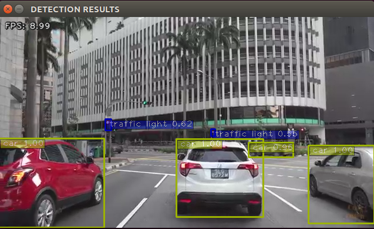
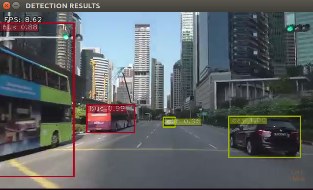
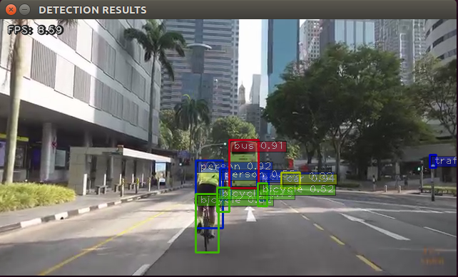
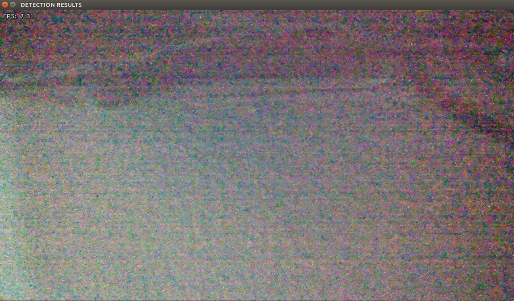
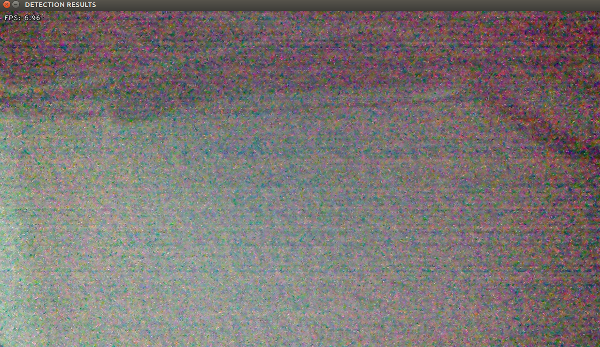

# YOLOv4 with TensorRT engine

This package contains the yolov4_trt_node that performs the inference using NVIDIA's TensorRT engine

This package works for both YOLOv3 and YOLOv4. Do change the commands accordingly, corresponding to the YOLO model used.

Average FPS for yolov4-416 on a 640x360 input is ~ 9 FPS



---
## Setting up the environment

### Install dependencies

### Current Environment:

- Jetson   == Tx2

- Jetpack  == 4.4

- CUDA     == 10.2

#### Dependencies:

- TensorRT == 6+

- OpenCV == 3.x +

- numpy == 1.15.1 +

- Protobuf == 3.8.0

- Pycuda == 2019.1.2

- onnx == 1.4.1 (depends on Protobuf)

### Install all dependencies with below commands

```
Install pycuda (takes awhile)
$ cd ${HOME}/catkin_ws/src/yolov4_trt_ros/dependencies
$ ./install_pycuda.sh

Install Protobuf (takes awhile)
$ cd ${HOME}/catkin_ws/src/yolov4_trt_ros/dependencies
$ ./install_protobuf-3.8.0.sh

Install onnx (depends on Protobuf above)
$ sudo pip3 install onnx==1.4.1
```

* Please also install [jetson-inference](https://github.com/dusty-nv/ros_deep_learning#jetson-inference)
---
## Setting up the package

### 1. Clone project into catkin_ws and build it

``` 
$ cd ~/catkin_ws && catkin_make
$ source devel/setup.bash
```

### 2. Make libyolo_layer.so

```
$ cd ${HOME}/catkin_ws/src/yolov4_trt_ros/plugins
$ make
```

This will generate a libyolo_layer.so file

### 3. Change libyolo_layer.so path in yolo_with_plugins_v4.py

```
$ cd ${HOME}/catkin_ws/src/yolov4_trt_ros/utils
```

Change the path in Line 13 to the correct full path of the previously built `libyolo_layer.so` file

### 4. Place your yolo.weights and yolo.cfg file in the yolo folder

```
$ cd ${HOME}/catkin_ws/src/yolov4_trt_ros/yolo
```
** Please name the yolov4.weights and yolov4.cfg file as follows:
- yolov4.weights
- yolov4.cfg

** Replace the -416 with any input shape you want (208/416/608)

```
$ echo "Creating yolov4-416.cfg and yolov4-416.weights"
$ cat yolov4.cfg | sed -e '2s/batch=64/batch=1/' | sed -e '7s/width=608/width=416/' | sed -e '8s/height=608/height=416/' > yolov4-416.cfg
$ ln -sf yolov4.weights yolov4-416.weights
```

#### For YOLOv3
```
# python3 yolo_to_onnx.py -m model_name -c category_num[80]
$ python3 yolo_to_onnx.py -m yolov3-416

# python3 onnx_to_tensorrt.py -m model_name -c category_num[80]
$ python3 onnx_to_tensorrt.py -m yolov3-416
```

#### For YOLOv4
```
# python3 yolo_to_onnx.py -m model_name -c category_num[80]
$ python3 yolo_to_onnx.py -m yolov4-416

# python3 onnx_to_tensorrt.py -m model_name -c category_num[80]
$ python3 onnx_to_tensorrt.py -m yolov4-416
```

- This conversion might take awhile
- The optimised TensorRT engine would now be saved as yolov3-416.trt / yolov4-416.trt

### 5. Change the class labels

```
$ cd ${HOME}/catkin_ws/src/yolov4_trt_ros/utils
$ vim yolo_classes.py
```

- Change the class labels to suit your model

### 6. Change the video_input and topic_name

```
$ cd ${HOME}/catkin_ws/src/yolov4_trt_ros/launch
```

- `yolov3_trt.launch` : change the topic_name

- `yolov4_trt.launch` : change the topic_name

- `video_source.launch` : change the input format 

   *video_source.launch requires jetson-inference to be installed

---
## Using the package

### Running the package

Note: Run the launch files separately in different terminals

### 1. Run the video_source 

```
# For csi input
$ roslaunch yolov4_trt_ros video_source.launch input:=csi://0

# For video input
$ roslaunch yolov4_trt_ros video_source.launch input:=/path_to_video/video.mp4
```

### 2. Run the yolo detector

```
# For YOLOv3
$ roslaunch yolov4_trt_ros yolov3_trt.launch

# For YOLOv4
$ roslaunch yolov4_trt_ros yolov4_trt.launch
```

### Parameters

- str model = "yolov3" or "yolov4" 
- str model_path = "/abs_path_to_model/"
- int input_shape = 288/416/608
- int category_num = 80
- double conf_th = 0.5
- bool show_img = True

---
## Results obtained

### 1. Screenshots 

### Video_in: .mp4 video (640x360)

### Avg FPS : ~9






---

### Video_in: CSI_cam (1280x720)

### Avg FPS : ~7





---
## Licenses and References

### 1. Referenced source code from [jkjung-avt](https://github.com/jkjung-avt/) and his project with tensorrt samples

I also used the pycuda and protobuf installation script from his project

Those code are under [MIT License](https://github.com/jkjung-avt/tensorrt_demos/blob/master/LICENSE)

### 2. Referenced video_input source code from [dusty-nv](https://github.com/dusty-nv/ros_deep_learning#jetson-inference)